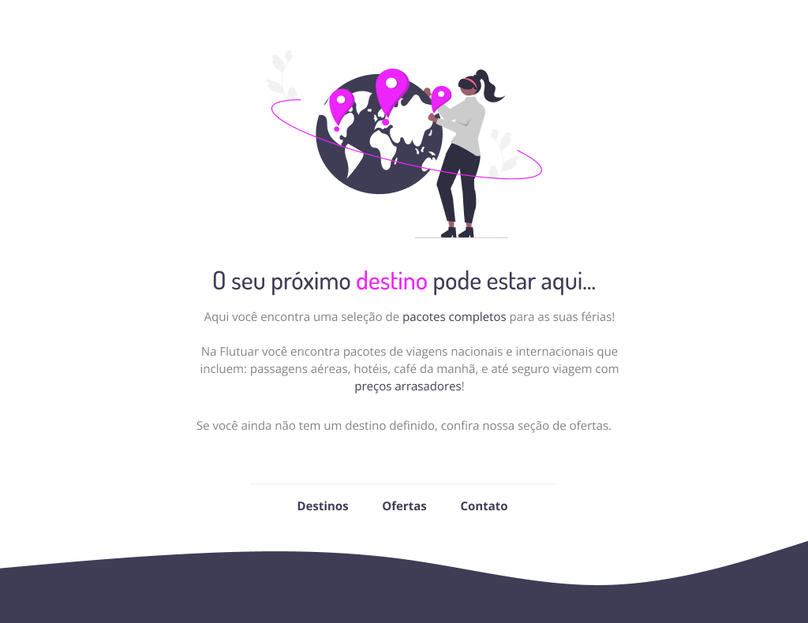

<h1 align="center"> Desafio intermediário - Recriando layout </h1>

Desafio para recriar layout pronto no Figma para fortalecer alguns conceitos aprendidos nas aulas 

  <a href="#-tecnologias">Tecnologias</a>&nbsp;&nbsp;&nbsp;|&nbsp;&nbsp;&nbsp;
  <a href="#-projeto">Projeto</a>&nbsp;&nbsp;&nbsp;|&nbsp;&nbsp;&nbsp;
  <a href="#-layout">Layout</a>&nbsp;&nbsp;&nbsp;|&nbsp;&nbsp;&nbsp;
 

 

  

## 🚀 Tecnologias

Esse projeto foi desenvolvido com as seguintes tecnologias:

- HTML e CSS
- Figma

## 🔖 Layout

Você pode visualizar o layout do projeto através [desse link](https://www.figma.com/file/2rbhyzv0An31Ln0N0YUSD2/Projeto01-Extra-(Copy)?type=design&node-id=0%3A1&mode=design&t=ULaJls2SCVIkxTly-1).
É necessário ter uma conta no [Figma](https://www.figma.com) 

## 📝 Licença

Esse projeto está sob a licença MIT.

 

---

Feito com ♥ by Rodrigo Castro